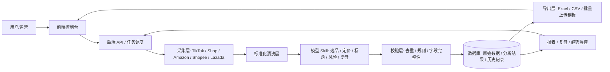

# 企业 MVP 职责分工图

这份文档只解决一件事：**模型 Skill、采集层、后端 API、数据库、前端、导出层分别负责什么，不能负责什么**。

你的目标不是做一个“会聊天的选品工具”，而是做一套能长期运行的跨境选品业务系统。

---

# 一、核心原则

1. `模型 Skill` 负责判断和生成，不负责存储和调度。
2. `数据库` 负责记忆和追溯，不负责思考。
3. `后端 API` 负责编排、约束、审计，不只是转发。
4. `采集层` 负责拿原始数据，不负责下结论。
5. `前端` 负责任务配置和结果查看，不负责业务计算。
6. `导出层` 负责把结果变成 Excel、CSV、上传模板，不负责业务判断。

---

# 二、总体架构

---

# 三、职责边界

## 1. 模型 Skill

### 负责什么

- 判断产品是否值得进入
- 从评论、标题、视频、热词中提炼需求信号
- 生成产品名、标题、卖点、场景词、长尾词
- 生成建议售价、利润判断、风险判断
- 输出结构化的选品结论
- 按规则生成可直接入库的结果字段

### 不负责什么

- 不直接抓网页
- 不直接写数据库
- 不直接控制任务队列
- 不直接生成最终 Excel 文件

### 你应该把它理解成

- 选品分析师
- 定价分析师
- 标题文案专家
- 风险判断专家

---

## 2. 采集层

### 负责什么

- 抓 TikTok 内容、评论、点赞、链接
- 抓 TikTok Shop 热门商品
- 抓 Amazon、Shopee、Lazada 对标商品
- 抓商品图、视频图、商品详情页、价格、规格
- 保存原始证据，方便回溯

### 不负责什么

- 不负责最终判断
- 不负责标题生成
- 不负责利润核算
- 不负责去重策略

### 你应该把它理解成

- 外勤采集员
- 原始信号采集器

---

## 3. 后端 API

### 负责什么

- 接收用户任务参数
- 拆分任务和分配步骤
- 调用采集层和模型 Skill
- 校验输出格式
- 写入数据库
- 处理任务状态、失败重试、超时
- 维护去重和版本记录
- 生成导出任务

### 不负责什么

- 不做业务推断
- 不替代模型进行分析
- 不把所有逻辑写死在接口里

### 你应该把它理解成

- 系统总调度
- 规则执行器
- 审计控制台

---

## 4. 数据库

### 负责什么

- 存原始采集数据
- 存模型分析结果
- 存历史推送记录
- 存去重键
- 存价格历史
- 存任务状态和日志
- 存证据链

### 建议至少分表

- `raw_sources`
- `candidate_products`
- `analysis_results`
- `pricing_results`
- `title_results`
- `daily_pushes`
- `dedupe_keys`
- `task_logs`
- `shop_profiles`

### 不负责什么

- 不负责思考
- 不负责自动抓取
- 不负责业务编排

### 你应该把它理解成

- 事实库
- 历史库
- 可追溯证据库

---

## 5. 前端

### 负责什么

- 配置国家、类目、平台、排除词、数量
- 查看候选产品池
- 查看分析结果和证据链
- 执行人工筛选、驳回、标记
- 查看历史推送，避免重复
- 一键导出 Excel

### 不负责什么

- 不做复杂业务规则计算
- 不做采集
- 不做模型推理

### 你应该把它理解成

- 业务控制台
- 人工审核台
- 可视化工作台

---

## 6. 导出层

### 负责什么

- 生成标准 Excel
- 生成批量上传模板
- 生成每日推送表
- 生成定价表
- 生成复盘表

### 不负责什么

- 不决定产品是否可推
- 不修改业务逻辑

### 你应该把它理解成

- 结果落地器
- 模板转换器

---

# 四、最关键的分工关系

## 1. 模型 Skill 和后端 API 的关系

模型 Skill 负责“判断与生成”。  
后端 API 负责“调用顺序、参数约束、异常处理、结果入库”。

如果把两者混在一起，后期一定会出现：

- 规则散落在各处
- 结果无法追踪
- 任务失败后无法重跑
- 去重逻辑失控

## 2. 数据库和 Excel 的关系

Excel 只是输出格式，不应该当主数据库。  
数据库才是主系统，Excel 只是某一次任务的导出结果。

## 3. Notion 的定位

Notion 可以做：

- 项目文档
- 人工记录
- 任务看板
- 运营复盘

Notion 不建议作为主业务数据库，因为：

- 去重能力弱
- 关系查询不适合复杂业务
- 自动化写入和版本控制不够稳

如果你要做企业 MVP，主数据库更适合用 `PostgreSQL`。  
如果你想先做轻量运营台，可以用 `Airtable` 过渡。

---

# 五、MVP 推荐职责划分

## 第一阶段

- 前端：简单控制台
- API：任务创建和结果查询
- 采集层：半自动抓取
- 模型 Skill：分析、定价、标题生成
- 数据库：记录结果和历史
- 导出层：Excel 输出

## 第二阶段

- 增加定时任务
- 增加自动去重
- 增加异常监控
- 增加复盘看板
- 增加对标店铺跟踪

## 第三阶段

- 自动触发
- 自动采集
- 自动分析
- 自动导出
- 自动监控和再学习

---

# 六、建议你采用的系统定位

你这套系统最合理的定位是：

- `Skill` = 业务智能层
- `API` = 业务中台
- `DB` = 业务记忆层
- `Crawler` = 业务采集层
- `Frontend` = 业务操作层
- `Excel Export` = 交付层

这套分工的好处是：

1. 模型能力可以持续升级，不会污染业务主流程。
2. 数据能够长期积累，方便做去重和趋势判断。
3. 后端只管流程，系统更稳定。
4. 前端和导出层可以独立替换，不影响核心逻辑。

---

# 七、你后续最该补的 3 个模块

1. `去重模块`
2. `价格核算模块`
3. `结果复盘模块`

这三个模块决定你的系统能不能从“做一次”变成“每天都能跑”。

