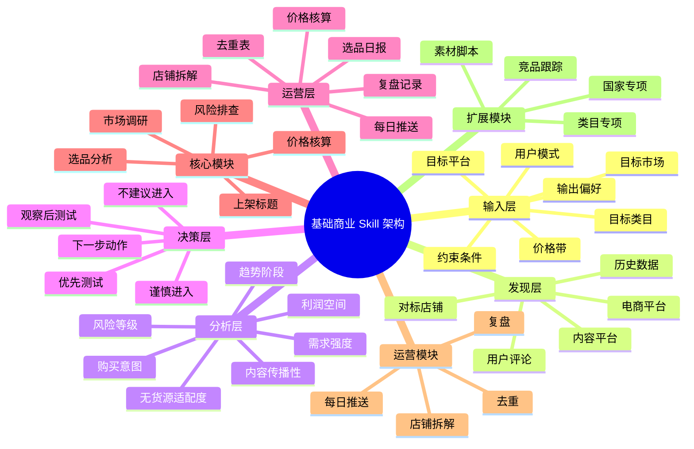

# 基础商业 Skill 架构设计思维导图

下面这份思维导图用于描述当前 `调研总包` 的基础商业 Skill 架构。  
它的目标是先把骨架定住，再往里面扩展选品、定价、推送、复盘等模块。

## 结构说明

### 1. 输入层

负责把问题说清楚，避免后面的分析建立在模糊前提上。

### 2. 发现层

负责从市场里找出可以分析的候选对象，不直接下结论。

### 3. 分析层

负责做结构化判断，是整个 Skill 的核心判断层。

### 4. 决策层

负责把分析结果转成明确动作，保证输出可执行。

### 5. 运营层

负责把日常执行沉淀下来，形成长期可复用的工作流。

## 后续扩展原则

1. 新模块先判断属于哪一层。
2. 新模块必须有明确输入和输出。
3. 新模块不能破坏现有 5 层骨架。
4. 新模块优先挂到 `docs/templates/`、`docs/vocab/`、`scripts/` 或 `outputs/`，不要再平铺到根目录。

## 建议使用方式

- 打开这份导图，先看整体结构。
- 再看 [基础商业 Skill 架构](./基础商业Skill架构.md) 了解规则。
- 最后按 [技能说明](./SKILL.md) 和各模板进入实际执行。
